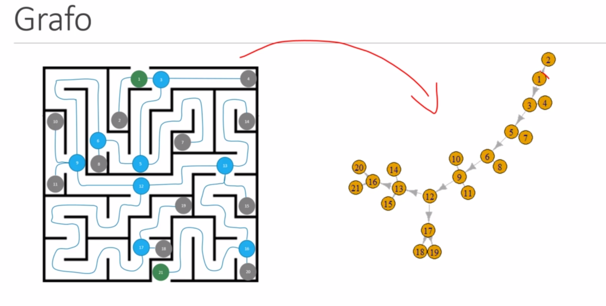

# Caminhos

Encontrar caminhos ou labirintos não existe solução parcial... Dado isso, é necessário uma Blind Search

 - Exemplo: Lee Algorithm (Breadth-first)

## Labirintos:

Necessária a transformação em Grafos:

 - Nodo no inicio
 - Nodo no fim
 - Nodo a cada divisão do labirinto (intermediários)
 - Nodo a cada ponta sem saída (Local Optima)
 - Apenas o nodo de inicio e interediários podem ter mais de uma aresta

Exemplo:

 

Exemplos reais demonstra, que algortimtos como Hill Climbing  POssui probabilidade baixissima de encontrar a solução Optima (Que na verdade é a única possível)

## Função Objeto (Objetivo)

A função que define/avalia a solução ou evolução encontrada.

Em labirintos essa função é muito dificil medir, já que somente há uma saída. Porém se houver outras saídas isso pode ser levado em consideração. 
POrém o ponto importante é, não dá para medir melhoria enquanto estiver rodando o algoritmo.