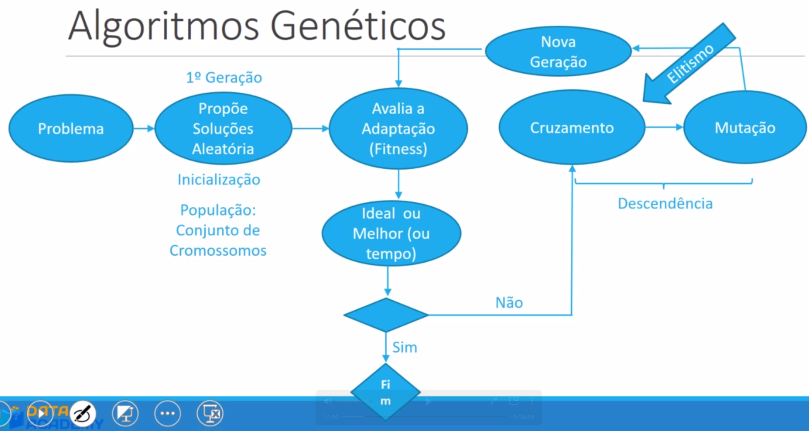

# Processo Evolutivo

## Seleção Natural
Recombinação Mutação Elitismo...

Genes dos filhos é vinda de uma combinação dos genes do pai e da mãe e adicionada uma aleatoriedade.

 - Pode trazer uma vantagem, ou desvantagem.
 - Quando vantagem, o ser pode sobreviver mais, ou seja, reproduzindo mais.
 - Quando desvantagem, o ser vivo pode viver menos, ou seja, tendo sua carga genética sendo menor reproduzida às posteriores gerações.

Algoritmos genéticos procuram copiar a evolução natural para chegar na resolução de problemas usando IA.

## Algoritmos Genéticos

Problemas de busca, otimização, agendamento...

 - Possui condição de parada, diferentemente da natureza. (Contínuo VS Discreto)

### Adaptação | Fitness

Quanto mais próxima uma geração está do objetivo final, mais ela tem chance de ser escolhida para produzir a próxima geração.

1. Soluções aleatórias (Cromossomos com genes aleatórios)
2. Avaliação da adaptação (Ideal, Melhor ou tempo/ciclo de processamento), caso chegue no final, vá para o passo 6.
3. Segue para produzir uma nova geração.
4. Cromossomos sofrem Cruzamento, Mutação (Chance aleatória de produzir uma mudança na carga genética dos cromossomos) e Elitismo (Os elementos mais próximos da solução não são cruzados, porém são transmitidos para a próxima geração)
5. Nova geração criada, volte para o Passo 2.
6. Fim.

### Cromosomos e População

 - Solução proposta para o problema.
 - População é o conjunto de cromossomos com propostas de solução para o problema.
 - A população não deve ser muito grande nem muito pequena.

### Genes